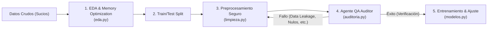

# DS Guardian – AI Framework for Robust Data Science Projects

[](https://www.python.org/)
[](LICENSE)
[]()
[]()
[](.github/workflows/ci.yml)
[](docs/)
[]()
[](https://github.com/psf/black)
[](https://github.com/astral-sh/ruff)

# DS Guardian v1.0.0

Primera versión pública de DS Guardian, un framework orientado a la auditoría, limpieza y gobernanza de proyectos de ciencia de datos y machine learning.

## ¿Qué incluye?
- Auditoría automática de calidad de datos
- Detección de nulos, outliers y multicolinealidad
- Validación de fugas de información (data leakage)
- Limpieza y preprocesamiento seguro
- Codificación, imputación y escalado de variables
- Exploratory Data Analysis para entornos de producción
- Visualización de distribuciones y correlaciones
- Evaluación de modelos de clasificación y regresión
- Exportación de modelos y metadatos
- Reportes Markdown y HTML de auditoría

## Propósito
DS Guardian ayuda a reducir errores frecuentes en pipelines analíticos, reforzar buenas prácticas ML y mejorar la trazabilidad y confiabilidad de proyectos de datos.

## Instalación
```bash
pip install ds-guardian==1.0.0
```

---

## 🎯 Filosofía del Proyecto

En el desarrollo tradicional de Ciencia de Datos, los proyectos suelen estar llenos de notebooks estructurados en scripts planos propensos a fallos. **DS Guardian** introduce una capa intermedia modular que audita y asegura el flujo de datos:



---

## 🛠️ Arquitectura de Módulos

El framework se compone de los siguientes submódulos y responsabilidades:

1. **`ds_guardian.eda`**:
   * Optimización automática del consumo en memoria RAM (`optimizar_memoria`).
   * Detección (`detectar_outliers_iqr`) y acotamiento de valores atípicos mediante *Winsorization/Capping* (`acotar_outliers_iqr`).
2. **`ds_guardian.limpieza`**:
   * Imputación de valores faltantes libre de data leakage (`imputar_nulos`).
   * Codificación y alineación automática de variables categóricas (`codificar_variables`).
   * Escalamiento robusto ajustado únicamente en datos de entrenamiento (`escalar_caracteristicas`).
3. **`ds_guardian.visualizacion`**:
   * Configuración de estilos claro y oscuro (`configurar_estilo`).
   * Gráficos premium optimizados para entornos de producción y ejecución headless (`save_path`).
   * Gráficos de relevancia de predictores (`plot_importancia_caracteristicas`).
4. **`ds_guardian.modelos`**:
   * Wrapper integrado para búsqueda aleatoria de hiperparámetros con validación cruzada (`optimizar_hiperparametros`).
   * Reporte y visualización automatizada de métricas de clasificación y regresión (`evaluar_clasificacion`, `evaluar_regresion`).
5. **`ds_guardian.auditoria`**:
   * Auditor QA que evalúa el dataset y reporta problemas con códigos de colores ANSI (`revisar_datos_finales`).
   * Almacenamiento e historial comparativo de modelos entrenados (`registrar_y_comparar_modelo`).
6. **`ds_guardian.exceptions`**:
   * Definición de excepciones del dominio (`DataValidationError`, `ModelAuditingError`).

---

## 🚀 Instalación

DS Guardian sigue el estándar moderno de empaquetado de Python. Para instalarlo de forma local y editable, clona el repositorio y ejecuta:

```bash
# Instalar dependencias y paquete en modo de desarrollo
pip install -e .
```

O si deseas instalar las dependencias exactas usando el archivo de requerimientos:

```bash
pip install -r requirements.txt
```

---

## 📚 Documentación y Ejemplos

* **Documentación Completa**: Puedes encontrar especificaciones detalladas en la carpeta [docs/](docs/):
  * [Guía de Inicio Rápido (Getting Started)](docs/getting-started.md)
  * [Arquitectura del Framework](docs/architecture.md)
  * [Tutoriales de Uso](docs/tutorials/)
  * [Referencia de la API](docs/api.md)
  * [Preguntas Frecuentes (FAQ)](docs/faq.md)
  * [Hoja de Ruta (Roadmap)](docs/roadmap.md)
* **Carpeta de Ejemplos**: Revisa códigos ejecutables listos para usar en [examples/](examples/):
  * [classification.py](examples/classification.py) – Pipeline de clasificación de punta a punta.
  * [regression.py](examples/regression.py) – Pipeline de regresión completo.
  * [eda.py](examples/eda.py) – Demostración de optimización de memoria RAM y tratamiento de outliers.
  * [audit.py](examples/audit.py) – Auditoría QA de datos.

---

## 💻 Demostración de Uso Rápido

```python
import pandas as pd
from sklearn.model_selection import train_test_split
from sklearn.ensemble import RandomForestClassifier
from ds_guardian import eda, limpieza, modelos, auditoria, configurar_estilo

# 1. Cargar y optimizar (la optimización de memoria no depende del split)
df = pd.read_csv('dataset.csv')
df = eda.optimizar_memoria(df)

# 2. Dividir ANTES de tratar outliers, imputar, etc. para evitar Data Leakage
X = df.drop('target', axis=1)
y = df['target']
X_train, X_test, y_train, y_test = train_test_split(X, y, test_size=0.2, random_state=42)

# 3. Acotar outliers: los límites (IQR) se calculan solo con train
X_train, X_test = eda.acotar_outliers_iqr(X_train, df_test=X_test)

# 4. Preprocesamiento aislado y seguro
X_train, X_test = limpieza.imputar_nulos(X_train, X_test)
X_train, X_test = limpieza.codificar_variables(X_train, X_test)
X_train, X_test = limpieza.escalar_caracteristicas(X_train, X_test, metodo='standard')

# 5. Auditoría QA antes de entrenar
if auditoria.revisar_datos_finales(X_train, y=y_train):
    modelo = RandomForestClassifier(random_state=42)
    modelo.fit(X_train, y_train)
    y_pred = modelo.predict(X_test)
    modelos.evaluar_clasificacion(y_test, y_pred, save_path='plots/matriz_confusion.png')
```

---

## 📝 Licencia

Este proyecto está licenciado bajo la Licencia MIT. Consulta el archivo [LICENSE](LICENSE) para más detalles.
