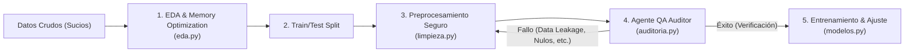

# DS Guardian

DS Guardian es un framework de código abierto en Python diseñado para ayudar a los profesionales de la Ciencia de Datos a construir flujos de trabajo de Machine Learning más robustos, reproducibles y confiables. Se enfoca en prevenir errores comunes como la fuga de datos (*data leakage*), manejar conjuntos de datos del mundo real y proporcionar verificaciones de calidad automatizadas antes de entrenar el modelo.

---

## 🎯 Why DS Guardian?

Este proyecto nació de una necesidad real observada en el desarrollo y enseñanza de la Ciencia de Datos:

1. **Evitar repetir código en notebooks**: La experimentación interactiva suele llevar a celdas desordenadas y fragmentadas. DS Guardian abstrae los componentes repetitivos en funciones modulares limpias.
2. **Aplicar buenas prácticas desde el inicio**: Establece una base sólida previniendo errores comunes de ingeniería antes de que los datos toquen los modelos de Machine Learning.
3. **Facilitar el aprendizaje sin sacrificar calidad**: Diseñado tanto para profesionales que buscan robustecer sus flujos como para estudiantes que desean aprender a desarrollar código limpio y modular bajo estándares de nivel de producción.

---

## 🛠️ Filosofía de Funcionamiento

DS Guardian actúa como una capa de auditoría y control de calidad entre la ingesta de datos y la fase de modelado:

---

## 🚀 Navegación Rápida

Comienza a explorar las diferentes secciones:

* **[Guía de Inicio](getting-started.md)**: Configuración inicial y creación de tu primer pipeline.
* **[Instalación](installation.md)**: Requisitos y opciones de instalación del paquete.
* **[Arquitectura](architecture.md)**: Detalles sobre el flujo de control y mitigación del Data Leakage.
* **[Referencia de la API](api.md)**: Métodos, firmas y docstrings detallados de los módulos.
* **[Tutoriales](tutorials/eda.md)**: Guías paso a paso de cada módulo.
* **[Preguntas Frecuentes](faq.md)**: Solución a dudas comunes del framework.
